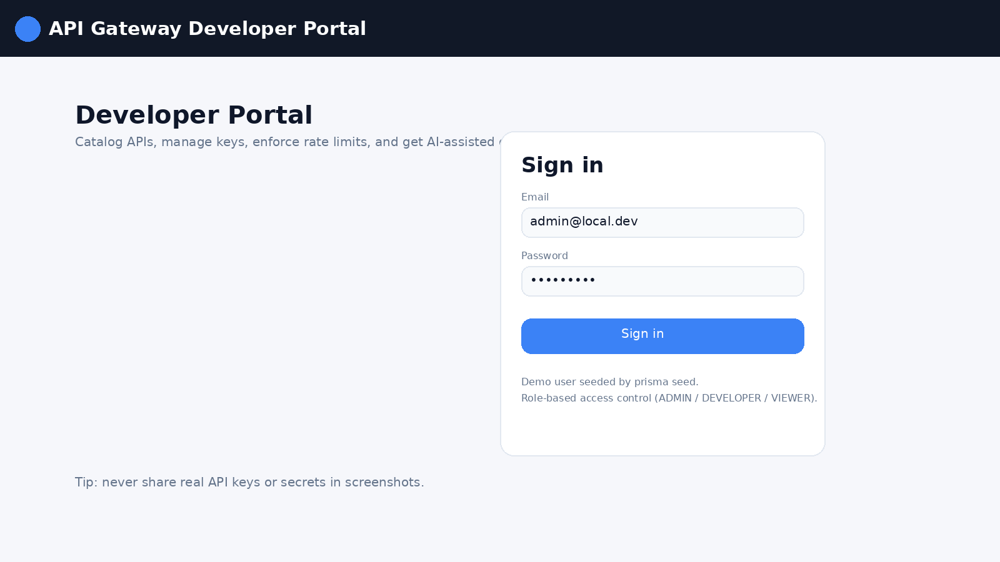
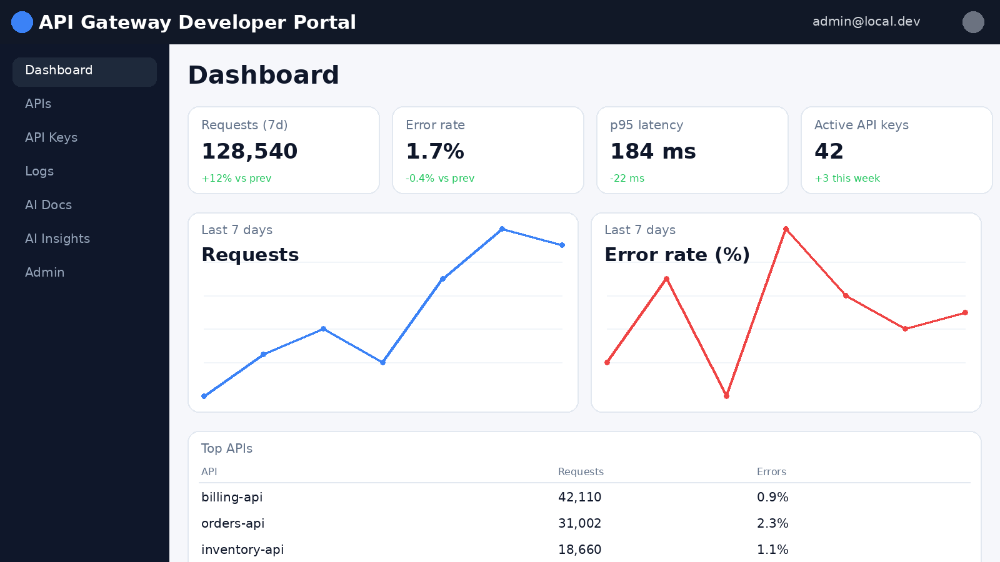
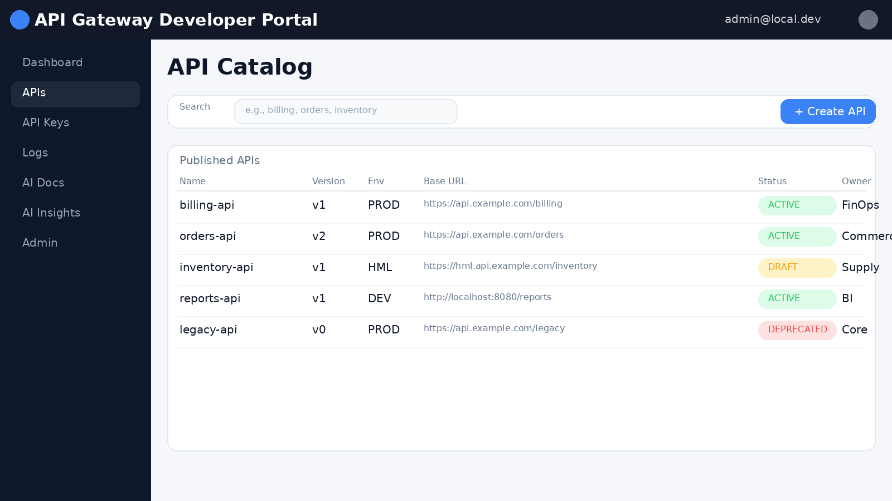
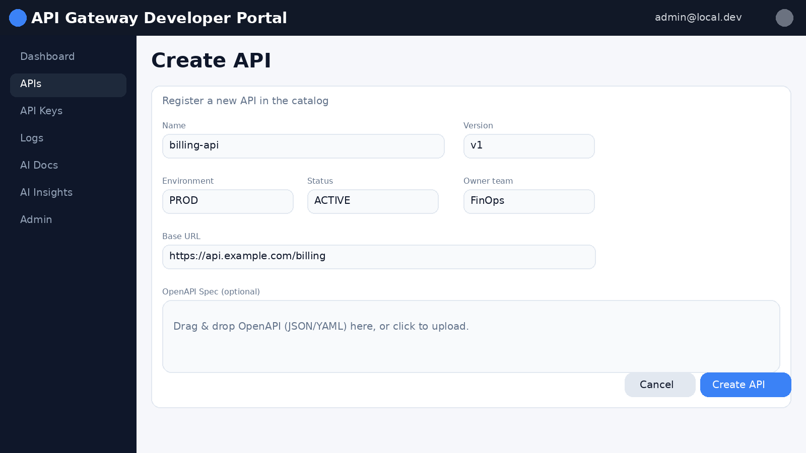
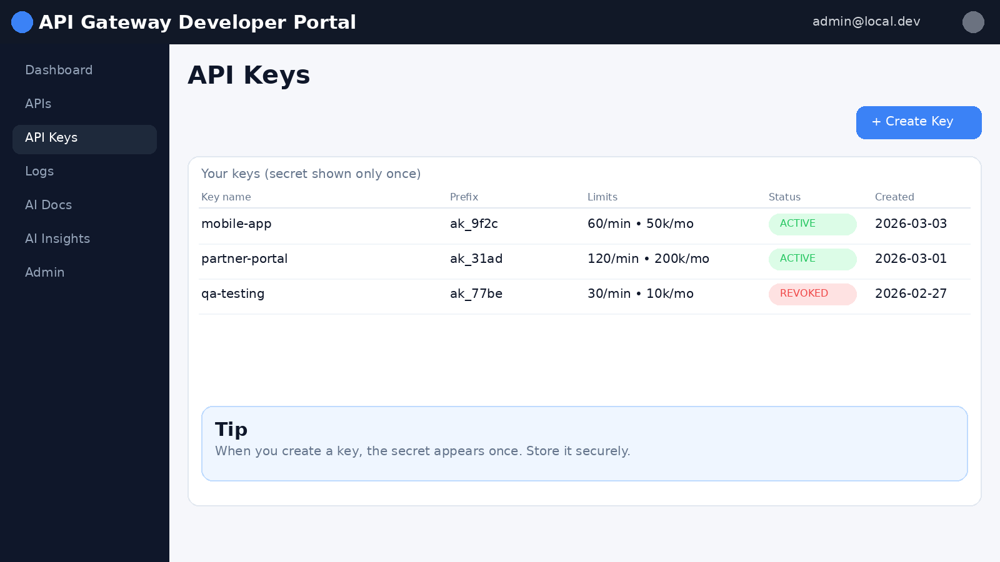
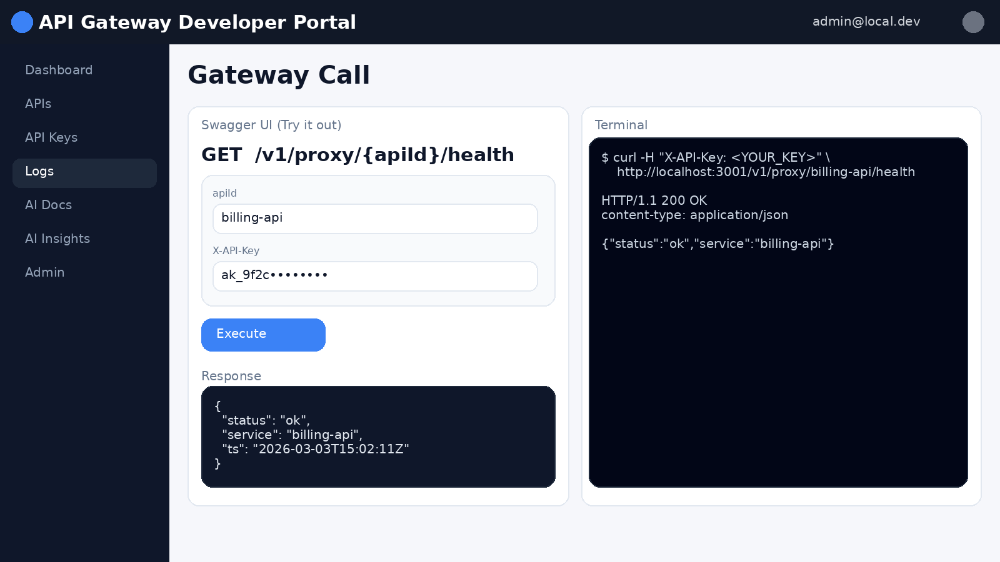
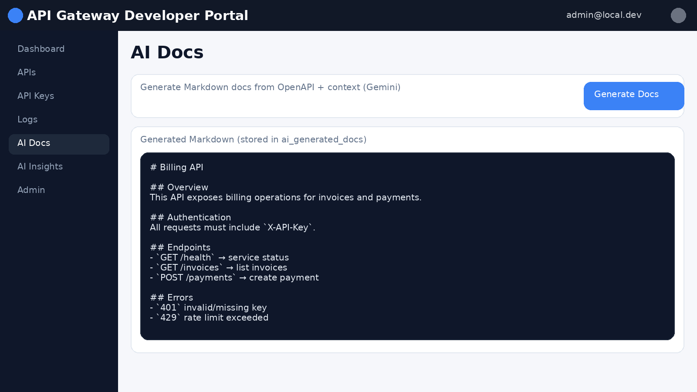
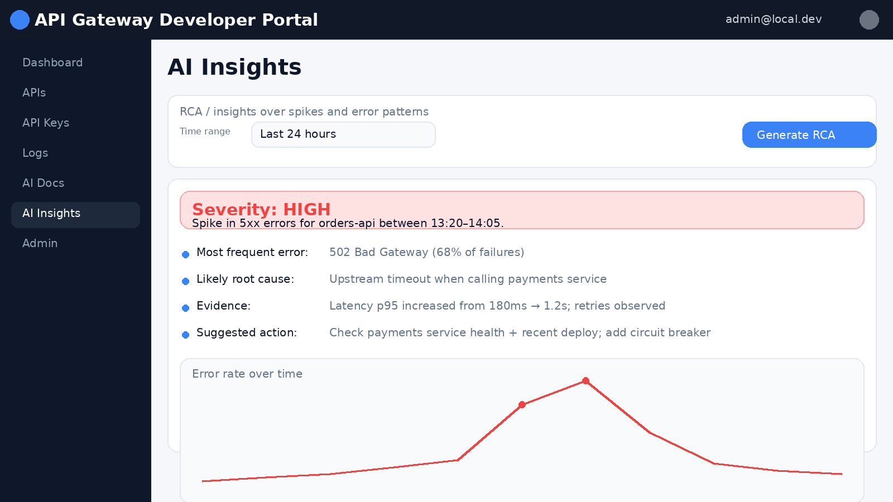

# api-gateway-developer-portal  

**Mini API Gateway + Developer Portal + AI Insights Engine**

A production-ready Full Stack SaaS (monorepo) built with **100% free-tier friendly** services: Vercel (web), Render (api), Neon (Postgres), Upstash (Redis), and Gemini (AI).

> **Why this exists**  
> Teams publishing internal/external APIs usually need **governance, API keys, rate limits, observability, usage analytics**, and increasingly **AI-assisted docs + RCA** — without adopting a heavy/expensive enterprise gateway on day 1.

---

## ✨ Product Capabilities

- **API Catalog**: CRUD for APIs (name, version, baseUrl, env, status, owner team)
- **API Keys**: create once (secret shown only once), revoke, per-key limits
- **Rate Limiting**: per minute + per month (Redis-backed), `X-API-Key` required
- **Request Logs**: structured request logging + latency measurement
- **Usage Dashboard**: 7-day usage, errors by code, latency, top APIs, per-key consumption
- **RBAC**: `ADMIN`, `DEVELOPER`, `VIEWER` (JWT auth)
- **AI Module (Gemini)**:
  - Generate Markdown docs from OpenAPI + context
  - RCA / insights over spikes and error patterns within a time range

---

## 📸 Product Tour (Screenshots)

A quick visual walkthrough so **non-technical users** can understand the product in ~1 minute.

> These screenshots are **illustrative demo UI** images for documentation.  
> For “real” screenshots of your running environment, run the app locally and replace the PNGs in `docs/screenshots/`.

### 1) Sign in (RBAC)


### 2) Usage dashboard (traffic, errors, latency)


### 3) API Catalog (discover and manage published APIs)


### 4) Create an API (name, version, baseUrl, environment)


### 5) API Keys (issue, revoke, set limits)


### 6) Call through the gateway (X-API-Key)


### 7) AI Docs (generate Markdown documentation)


### 8) AI Insights / RCA (explain spikes and error patterns)


---

## Tech Stack (Required)

### Frontend (Vercel Free)

- Next.js 14 (App Router), TypeScript
- TailwindCSS
- Recharts

### Backend (Render Free)

- NestJS, TypeScript
- Prisma ORM + Swagger/OpenAPI
- JWT Authentication
- Redis rate limiting (Upstash in prod)

### Data / Infra (Free tiers)

- PostgreSQL: Neon
- Redis: Upstash

### AI (Free tier)

- Google Gemini (API key via environment)

### CI/CD

- GitHub Actions (lint + tests + build)

---

## 🏗️ Monorepo Architecture

```text
api-gateway-developer-portal
├─ apps/
│  ├─ api/                 # NestJS API (gateway + admin APIs + AI)
│  └─ web/                 # Next.js Developer Portal
├─ docker-compose.yml      # Local Postgres + Redis
├─ .github/workflows/ci.yml
└─ README.md
```

### Backend layering (enterprise-friendly)

```text
apps/api/src
├─ modules/
│  ├─ auth/                # JWT + RBAC
│  ├─ apis/                # API catalog CRUD
│  ├─ api-keys/            # key issuance + revoke + limits
│  ├─ proxy/               # gateway proxy (X-API-Key required)
│  ├─ metrics/             # dashboard aggregates
│  └─ ai/                  # Gemini: docs + RCA insights
├─ common/
│  ├─ prisma/              # PrismaService, module
│  ├─ guards/              # JwtAuthGuard, RolesGuard
│  ├─ interceptors/        # RequestLoggingInterceptor
│  ├─ filters/             # Global exception filter
│  └─ logger/              # structured logger (pino)
└─ prisma/
   ├─ schema.prisma
   └─ seed.ts
```

---

## 🧠 ASCII Diagram

```text
            ┌──────────────────────────────┐
            │        Next.js Portal        │
            │  - RBAC UI / Dashboard       │
            │  - API Catalog / Keys        │
            │  - AI Docs / RCA Buttons     │
            └───────────────┬──────────────┘
                            │ JWT (admin APIs)
                            ▼
            ┌──────────────────────────────┐
            │           NestJS API          │
            │  /auth /apis /api-keys        │
            │  /metrics /ai                 │
            │  /proxy/:apiId/*              │
            └───────┬───────────┬──────────┘
                    │           │
                    │           ├──────────────► Gemini (AI)
                    │
          ┌─────────▼──────────┐
          │   Postgres (Neon)  │
          │ users, apis, keys  │
          │ logs, violations   │
          │ ai docs/insights   │
          └─────────┬──────────┘
                    │
          ┌─────────▼──────────┐
          │   Redis (Upstash)  │
          │ rate limit counters │
          └────────────────────┘
```

---

## 🗃️ Database Model (Prisma)

Core tables:

- `users` (ADMIN/DEVELOPER/VIEWER)
- `apis` (catalog)
- `api_keys` (hashed secrets + limits + revokedAt)
- `request_logs` (observability)
- `rate_limit_violations` (audit)
- `ai_generated_docs` (Markdown docs)
- `ai_insights` (RCA output + severity)

> API keys are stored **hashed** (bcrypt) + a **prefix** to locate candidates quickly.

---

## ▶️ Run Locally

### 1) Prereqs

- Node 20+
- pnpm 9+
- Docker (for local Postgres + Redis)

### 2) Start Postgres + Redis

```bash
docker compose up -d
```

### 3) Configure env

Copy `.env.example` and optionally create per-app env files:

```bash
cp .env.example apps/api/.env
cp .env.example apps/web/.env.local
```

### 4) Install deps

```bash
pnpm install
```

### 5) Migrate + seed

```bash
pnpm --filter @portal/api prisma:migrate:dev
pnpm --filter @portal/api prisma:seed
```

### 6) Run

```bash
pnpm dev
```

- Web: http://localhost:3000
- API (Swagger): http://localhost:3001/v1/docs

Default seeded admin:

- Email: `admin@local.dev`
- Password: `admin12345`

---

## Key Workflows

### 1) Create API

Portal → **APIs** → Create

### 2) Create API Key

Portal → **API Keys** → Create  
The secret is shown **only once**. Store it safely.

### 3) Call through gateway

Use the proxy route:

```bash
curl -H "X-API-Key: <YOUR_KEY>"   http://localhost:3001/v1/proxy/<apiId>/health
```

---

## AI Features (Gemini)

### A) Generate API Docs

Backend:

- `POST /v1/ai/apis/:apiId/docs`

Frontend:

- Button: **Generate Docs with AI**

Docs are stored in `ai_generated_docs`.

### B) RCA / Insights over Logs

Backend:

- `POST /v1/ai/metrics/insights`

Frontend:

- Button: **Generate RCA**

Insights are stored in `ai_insights` and include a severity classification.

---

## Deploy (Free Tiers)

### Backend (Render)

1. Create a new **Web Service** on Render.
2. Root directory: `apps/api`
3. Build command:
   - `pnpm install --filter @portal/api... && pnpm --filter @portal/api build`
4. Start command:
   - `pnpm --filter @portal/api start:prod`
5. Set env vars on Render:
   - `DATABASE_URL` (Neon)
   - `REDIS_URL` (Upstash)
   - `JWT_SECRET`
   - `GEMINI_API_KEY`
   - `ADMIN_EMAIL`, `ADMIN_PASSWORD`, `ADMIN_NAME`

> Run Prisma migrate on deploy using Render “Pre-deploy Command”:  
> `pnpm --filter @portal/api prisma:migrate && pnpm --filter @portal/api prisma:seed`

### Frontend (Vercel)

1. Import GitHub repo on Vercel.
2. Root directory: `apps/web`
3. Env var:
   - `NEXT_PUBLIC_API_BASE_URL=https://<your-render-service>/v1`

---

## Quality Gates

Implemented:

- DTO validation (global `ValidationPipe`)
- Global exception filter
- Structured logging
- Unit tests (auth, rate limit, AI with mocks)
- GitHub Actions CI (lint + tests + build)

---

## 🗺️ Roadmap (Ideas)

- Per-route policies (allowlist/denylist)
- Usage plans (Free/Pro/Enterprise) + billing integration
- Webhooks + audit trail export (SIEM)
- OpenTelemetry tracing (OTLP) + trace correlation in UI
- API versioning strategies (semver enforcement)
- Multi-tenant orgs + SSO (OIDC/SAML)

---

## License

MIT
<!-- pullshark-1 -->
<!-- pullshark-2 -->
---

## Contributing

See `CONTRIBUTING.md` for semantic commits (Conventional Commits).
